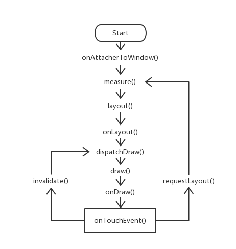

# HoSlidingLayout 侧滑栏

Author ： hosle

Created in 3rd May 2018 

## 主要特点

Android v4控件包提供了两种侧滑栏：

* ```android.support.v4.widget.DrawerLayout``` ： 侧滑栏滑出时，覆盖在主界面之上，不影响主界面的位置与布局；

* ```android.support.v4.widget.SlidingPaneLayout``` ： 滑动手指，主界面随手势移动。侧栏出现在主界面之下，位置与布局固定不动。

区别于以上两者，HoSlidingLayout具有以下主要特点：

* 一指拖动，从屏幕左**边缘拉出**侧滑栏；
* 侧滑栏与主界面**同步右移**；
* 主界面随移动增加**渐隐效果**；
* 具备**回弹**与**跟进**效果。

## 使用方法


### 1.1. 在布局XML中直接使用
* 与布局内，设定第一个子View为侧滑栏，第二个子View为主页面的根布局

```
<com.hosle.slidinglayout.HoSlidingLayout xmlns:android="http://schemas.android.com/apk/res/android"
    android:layout_width="match_parent"
    android:layout_height="match_parent">

	<!-- 侧滑栏根布局 -->
    <LinearLayout
        android:layout_width="match_parent"
        android:layout_height="match_parent">
    </LinearLayout>
	
	<!-- 主界面根布局 -->
    <LinearLayout
        android:layout_width="match_parent"
        android:layout_height="match_parent">
    </LinearLayout>

</com.hosle.slidinglayout.HoSlidingLayout>

```


### 1.2. 常用属性

属性名称|类型|描述
---|--- |---
slidable | Boolean | 是否允许侧滑
defaultMaxOffsetX | Float | 设置侧滑栏宽度，通过调用公有方法修改 ```fun setSlidingWidth(width:Int)```
edgeThreshold | Int | 侧滑边缘热区阈值
slideCoverAlpha | Float | 侧滑栏展开后，主页面的覆盖蒙层透明度
slideCoverColor | Int | 侧滑栏展开后，主页面的蒙层颜色

### 1.3. 添加回调
* 宿主外部可以获取侧滑栏不同状态的回调

```
sliding_layout.addOnSlidingListener(object : HoSlidingLayout.OnSlidingListener {
            override fun onStart(isOpenNow: Boolean) {
                //todo Layout获取焦点，进入滑动状态
            }
            override fun onSliding() {
                //todo 正在滑动
            }
            override fun onOpen() {
                //todo 侧滑栏已经完全展开
            }
            override fun onClose() {
                //todo 侧滑栏已经完全隐藏
            }
        })
```

### 1.4. 直接开闭侧栏

* 展开侧栏
```
fun openSlideBoard()
```
* 关闭侧栏
```
fun closeSlideBoard()
```


## 方法关键

### 2.1. 手势事件TouchEvent的拦截策略
* 与是否可滑动```slidable```、是否已打开```isSlideOpen```有关

	(1) 设置不能滑动时，包括```onInterceptTouchEvent()```和```onTouchEvent()```方法不响应手势。

	(2) 侧栏开启时，需要拦截主界面区域的手势事件

* ``onInterceptTouchEvent()``中，当View 对 ``event.ACTION_DOWN`` 事件返回false后，后面不会再接收到如``event.ACTION_MOVE``的其它事件

### 2.2. View的滑动处理

#### 2.2.1. requestLayout()与scrollTo()的选择

* 处理View的随手势滑动，比较两种方法。

	（1） 每次手势回调位置偏移后，调用```requestLayout()```方法，然后在```onLayout()```方法对子view重新布局，从而实现滑动。

	（2） 每次手势回调位置偏移后，调用```scrollTo()```/```scrollBy()```方法，从而实现滑动。

* 区别主要在于```requestLayout```方法会促使父级Viewgroup子view重新执行"measure-layout-draw"的步骤，改变子View的位置。而```scrollTo```方法只是改变子View的可见区域范围，其位置并未发生改变。然后通过```invalidate()```方法，重新调用“draw”流程刷新画布。（见图1）

* 从理论上说，当Viewgroup的层级较深，且```requestLayout```需要从较高的View树节点开始重新绘制，那么性能会较```invalidate()```低。



_图1 requestLayout()和invalidate()的流程比较_


#### 2.2.2. 解决步长、总偏移量与默认偏移量的关系

* 步长是指每次``onTouchEvent()``回调与上一次回调的位置差
* 总偏移量是指本次手势滑动的步长之和。目的用于本次滑动行程的边界判断。
* 默认偏移量是指侧滑栏滑出的最大宽度。

* **需要特别注意的**，使用```requestLayout()```时，用``getX()``,``getY()``描述View从开始到目前的偏移量。而使用```scrollTo()```方法时，则用``getScrollX()``和``getScrollY()``。而且两者的**坐标系不一样**。


#### 2.2.3. 利用Scroller实现回弹与跟进效果
* 调用``startScroll()``方法，及``invalidate()``方法
* 重写``override fun computeScroll()``方法

```
override fun computeScroll() {
        if (scroller.computeScrollOffset()) {
            scrollTo(scroller.currX, scroller.currY)
            invalidate()
        }
    }
```

### 2.3. 不能忽略onMeasure与onLayout

因为直接继承自Viewgroup类，所以，

* 必须实现``onLayout()``方法，将侧滑栏初始布局设置在屏幕以外。
* 重写``onMeasure()``方法，测量侧滑栏的View宽高。

### 2.4. 渐隐处理
* 在 ``drawChild()``方法里，调用``canvas.drawRect()``，在主界面的上面绘出蒙层。因为每次``invalidate()``的时候会调用``draw()``方法，画笔Paint的颜色透明度也可以根据每次的偏移量增减，实现渐变效果。

 ```
override fun drawChild(canvas: Canvas?, child: View?, drawingTime: Long): Boolean {
        val result = super.drawChild(canvas, child, drawingTime)

        paint.color = slideCoverColor
        paint.alpha = Math.round(subOffsetX / defaultMaxOffsetX * (255 * slideCoverAlpha).toFloat())
        canvas?.drawRect(0f, 0f, measuredWidth.toFloat(), measuredHeight.toFloat(), paint)

        return result
    }
 ```

## Todo
* 直接在XML中添加自定义属性
* 拓展上右下其余三个方向的侧边栏滑出
* 新增修改回弹与跟进的动画时间（Duration） API
* 针对宽屏，新增修改回弹临界线位置的API

## License

Copyright (C) 2018. Henry Tam (hosle)

Contact: hosle@163.com

Licensed under the Apache License, Version 2.0 (the "License"); you may not use this file except in compliance with the License. You may obtain a copy of the License at

http://www.apache.org/licenses/LICENSE-2.0

Unless required by applicable law or agreed to in writing, software distributed under the License is distributed on an "AS IS" BASIS, WITHOUT WARRANTIES OR CONDITIONS OF ANY KIND, either express or implied. See the License for the specific language governing permissions and limitations under the License.

